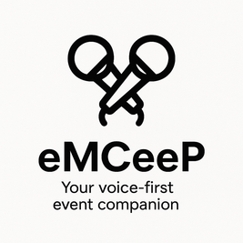

# EmCee P - AI Event Assistant

<p align="center">
  
</p>

An AI-powered voice assistant for event management that combines Langflow, Twilio voice services, and real-time event data processing.

## Overview

This hackathon project creates an intelligent event MC (Master of Ceremonies) called "P" that can handle voice calls, answer questions about events, and manage event data in real-time. The system integrates multiple technologies to provide a seamless voice-to-AI experience.

## Architecture

The project consists of two main components:

### 1. Twilio Voice Client (`/twilio-client`)

- **Node.js/Express** server handling incoming voice calls
- **Twilio ConversationRelay** for real-time speech-to-text and text-to-speech
- **WebSocket** integration for bidirectional communication
- **Langflow integration** via HTTP API calls

### 2. Langflow Components (`/langflow`)

- **Langflow Agent** (`EmCee P Agent.json`) - Import this JSON file into Langflow to create the AI agent
- **MCP Server** (`event-mcp-server.py`) - Model Context Protocol server for Langflow integration
- **Web API Server** (`webServer.py`) - Flask server serving event data via REST API
- **Event Data** (`data/event.json`) - JSON storage for event information

## Features

- 🎤 **Voice Call Handling**: Receive and process voice calls through Twilio
- 🤖 **AI Conversation**: Powered by Langflow agents for natural language processing
- 📅 **Event Management**: Real-time access to event schedules, attendees, and information
- 📱 **SMS Integration**: Send notifications and updates via Twilio SMS
- 🔄 **Real-time Updates**: WebSocket-based communication for live event data
- 📊 **Intent Recognition**: Classify and route voice commands appropriately

## Quick Start

### Prerequisites

- Node.js (v14+)
- Python 3.8+
- Twilio account with phone number
- ngrok for local development

### Setup

1. **Clone the repository**

   ```bash
   git clone <repository-url>
   cd langflow-hackathon
   ```

2. **Set up Twilio Client**

   ```bash
   cd twilio-client
   npm install
   cp .env.example .env
   # Configure your Twilio credentials in .env
   npm run dev
   ```

3. **Set up Langflow Components**

   ```bash
   cd langflow
   pip install -r requirements.txt

   # Install Langflow
   pip install langflow

   # Start Langflow and import the agent
   langflow run
   # In Langflow UI: Import 'EmCee P Agent.json' to create your agent

   # Start the MCP server (in a separate terminal)
   python event-mcp-server.py

   # Start the web API server (in another terminal)
   python webServer.py
   ```

   See [langflow docs](https://docs.langflow.org/) for troubleshooting

4. **Expose local server for webhooks**

   ```bash
   ngrok http 3000
   ```

5. **Configure Twilio webhook**
   - Set your Twilio phone number webhook to: `https://your-ngrok-url.ngrok.io/voice`

## How It Works

1. **Incoming Call**: User calls the Twilio number
2. **Voice Processing**: ConversationRelay converts speech to text in real-time
3. **AI Processing**: Text is sent to the Langflow agent for natural language understanding
4. **Event Data Access**: The Langflow agent uses the MCP server to access and update event information
5. **Live Updates**: When the agent updates `event.json`, changes are immediately available via the web API server
6. **Response**: AI response is converted back to speech and played to the caller

## API Endpoints

### Twilio Client

- `GET /health` - Health check
- `POST /voice` - Twilio webhook for incoming calls
- `WS /websocket` - WebSocket for ConversationRelay

### Web API Server (Flask)

- `GET /api/event` - Get complete event data
- `GET /api/schedule` - Get event schedule
- `GET /api/attendees` - Get attendee list
- `GET /api/organizers` - Get organizer information
- `GET /api/faq` - Get frequently asked questions

### MCP Server

- Provides tools for the Langflow agent to access and modify event data
- Integrates with `event.json` for real-time updates
- Handles SMS notifications via Twilio

## Development

Each component runs independently:

- **Twilio Client**: See `twilio-client/README.md` for detailed setup
- **Langflow Agent**: Import `EmCee P Agent.json` into Langflow, then configure MCP component to connect to the MCP server
- **MCP Server**: Run `python event-mcp-server.py` - provides tools for the Langflow agent
- **Web API Server**: Run `python webServer.py` - serves event data that updates when the agent modifies `event.json`

## Configuration

Key environment variables:

- `TWILIO_ACCOUNT_SID`, `TWILIO_AUTH_TOKEN` - Twilio credentials
- `LANGFLOW_URL` - Your Langflow agent endpoint
- `LANGFLOW_API_KEY` - Langflow authentication (if required)

## Testing

1. Call your Twilio phone number
2. Speak naturally to the AI assistant
3. Ask questions about the event (schedule, attendees, etc.)
4. The system will process your speech and respond with relevant information

## Technologies Used

- **Twilio**: Voice API and ConversationRelay
- **Langflow**: AI agent orchestration
- **Flask**: Web server for event data
- **Express.js**: Voice application server
- **WebSocket**: Real-time communication
- **MCP**: Model Context Protocol for AI integration
